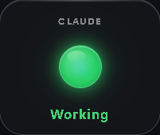
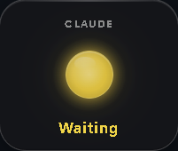
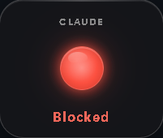

# AISignalLight

[English](README.en.md)

[](https://github.com/ZCCCCCCCCCC/AISignalLight/releases)

AI 编程助手桌面状态指示灯 —— 一个小巧的悬浮窗，告诉你 AI 当前在干什么。

<p align="center">
  
  
  
  
</p>

## 状态

| | 颜色 | 含义 |
|---|---|---|
| Working | 🟢 绿 | AI 工作中 |
| Waiting | 🟡 黄（闪烁） | 等待确认或输入 |
| Blocked | 🔴 红 | 出错或被拒 |
| Done | 🔵 蓝（闪烁） | 任务完成（30 秒后熄灭） |
| Idle | ⚫ 灰 | 空闲 |

多 AI 同时运行时优先级：Blocked > Waiting > Working > Idle。

---

## 普通用户

从 [Releases](https://github.com/ZCCCCCCCCCC/AISignalLight/releases) 下载 `AISignalLight-V0.1.exe`，双击运行，无依赖。

| 操作 | 效果 |
|---|---|
| 拖动 | 移动悬浮窗 |
| 双击 | 切到当前活跃 AI 工具的窗口 |
| 右键 | Reset / 重启 / 打开目录 / 退出 |
| 托盘右键 | 同上 + 开机自启 |

### 关联 AI 工具

让 Claude Code、Cursor 等自动上报状态，需要安装钩子。

> 钩子是一段小命令，AI 工具在工作/等待/报错时自动调用，灯就会跟着变。

首先确保 Python 3.10+ 已安装，然后跑：

```powershell
powershell -ExecutionPolicy Bypass -File .\scripts\install-hooks.ps1 -Target all
```

支持：`claude`、`codex`、`cursor`、`antigravity`。装完重启对���的 AI 工具即可。

---

## 开发者

### 从源码构建

```bash
cd tauri-widget
npm install
npm run tauri build
```

需要 Rust + Node.js + Windows。

### HTTP Bridge

exe 启动后自动监听 `127.0.0.1:57422`，外部工具可直接 POST 改变状态：

```http
POST http://127.0.0.1:57422/state
Content-Type: application/json

{"state": "working", "source": "codexpp"}
```

### CLI

```powershell
python -m ai_traffic_light_win.cli set working claude
python -m ai_traffic_light_win.cli reset
python -m ai_traffic_light_win.cli show
```

### 项目结构

```text
├── ai_traffic_light_win/   # Python 状态引擎（CLI + Hook 合并）
├── tauri-widget/           # 悬浮窗源码（Tauri + HTML/CSS/JS）
├── hooks/                  # 各 AI 工具 Hook 模板
└── scripts/                # 安装脚本
```

## License

MIT
